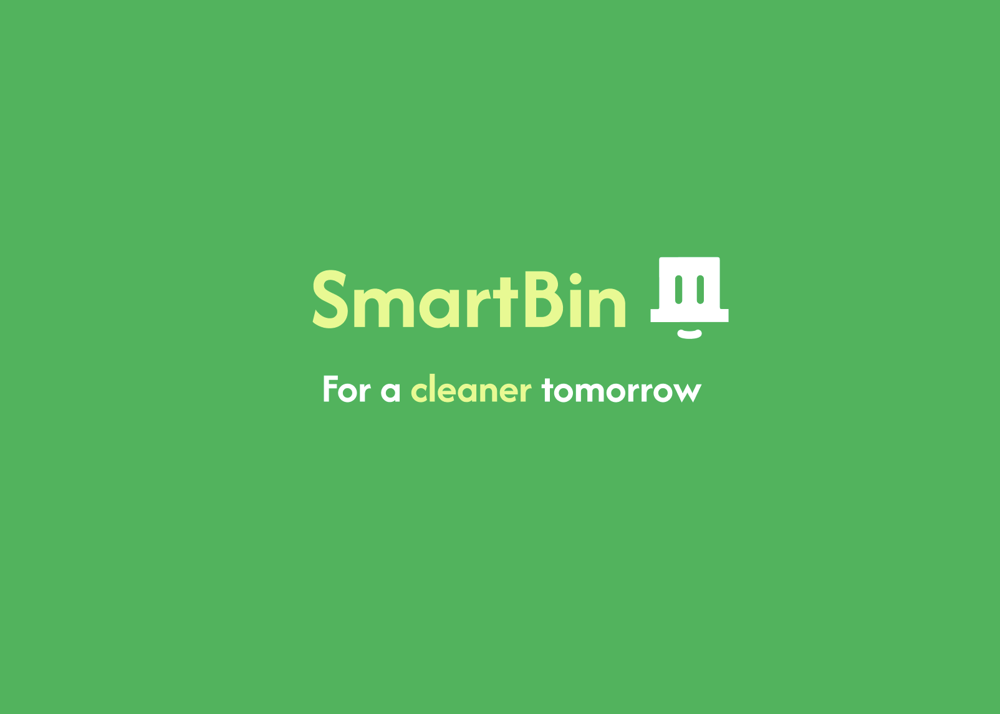
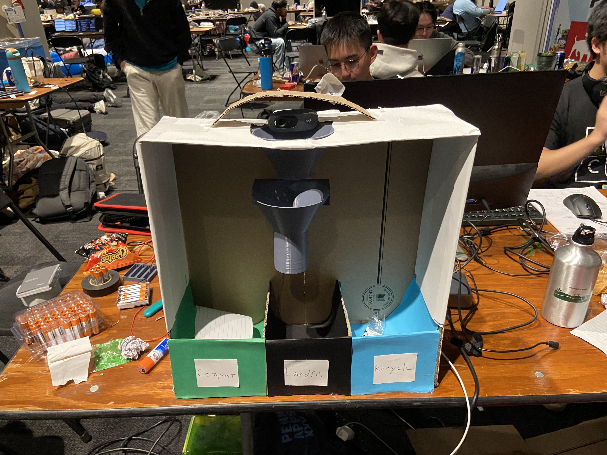
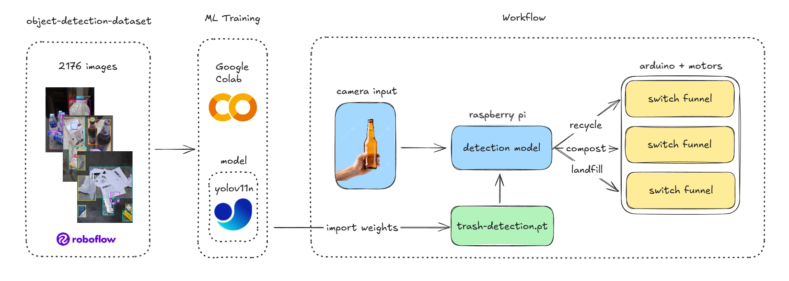
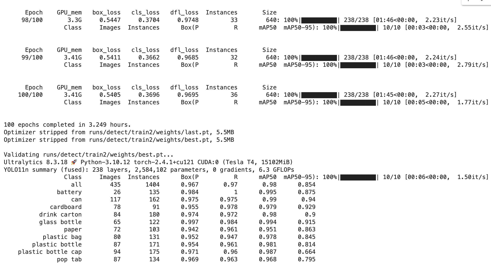

# SmartBin - 

## Intro
Introducing SmartBin—an automated hardware solution that sorts trash automatically into the correct bins for compost, landfill, and recycling. Using a combination of a Servo Motor, Arduino Uno, custom-designed and 3D-printed funnels, and a computer vision YOLO-trained model, we’ve developed a system that makes waste sorting more accurate and efficient, reducing the need for manual labor.

## How does it work?
Just three simple steps. Throw your trash in the chute, SmartBin scans, and the pipe motor directs.
SmartBin uses a camera to capture images of waste as it’s placed into the system. These images are then processed using a YOLO model running on a Raspberry Pi, which is trained to identify whether an item is compostable, recyclable, or destined for the landfill. YOLO’s real-time image recognition helps classify items quickly and accurately.

## Trash Detection Model
We grabbed datasets from Roboflow and uploaded them onto Ultralytics Hub to train our model on Google Colab for over 100 Epochs and classified 10 main classes that revolve around daily urban trash.

### Workflow

### ML Training

P.S. We trained the model at the hotel nearby to get better wifi power.

### Pitch Deck
[Figma Pitch Deck Presentation Slides](https://www.figma.com/proto/fPMhEasDlWZEEhfg6660DM/SmartBin?node-id=50-180&node-type=canvas&t=3vaZL3ahZxr8h3Yb-1&scaling=contain&content-scaling=fixed&page-id=0%3A1)

[Figma Design Workflow](https://www.figma.com/design/0ZV7e0JJXtjuXRCYjlXEfv/SmartBin-Template?node-id=0-1&t=e87UqHIZ6ZarGZek-1)

## Conclusion
With SmartBin, we’re offering a practical and sustainable solution to a widespread issue, making waste management at large events simpler, more efficient, and compliant with regulations. Join us in working toward a cleaner tomorrow.
Thank you!
